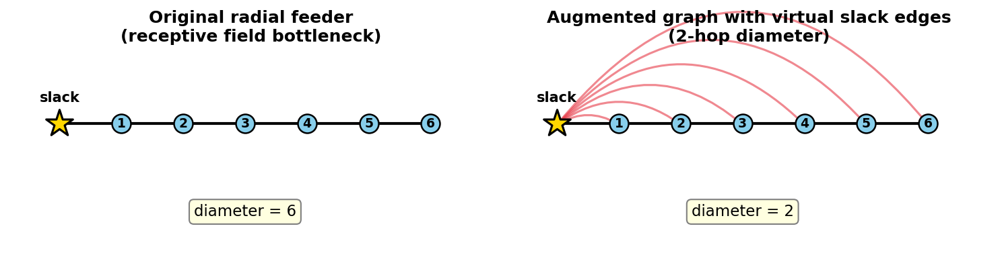
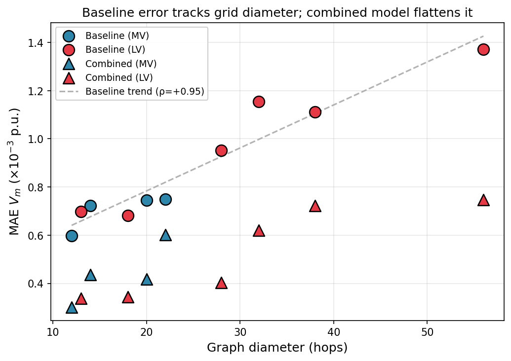
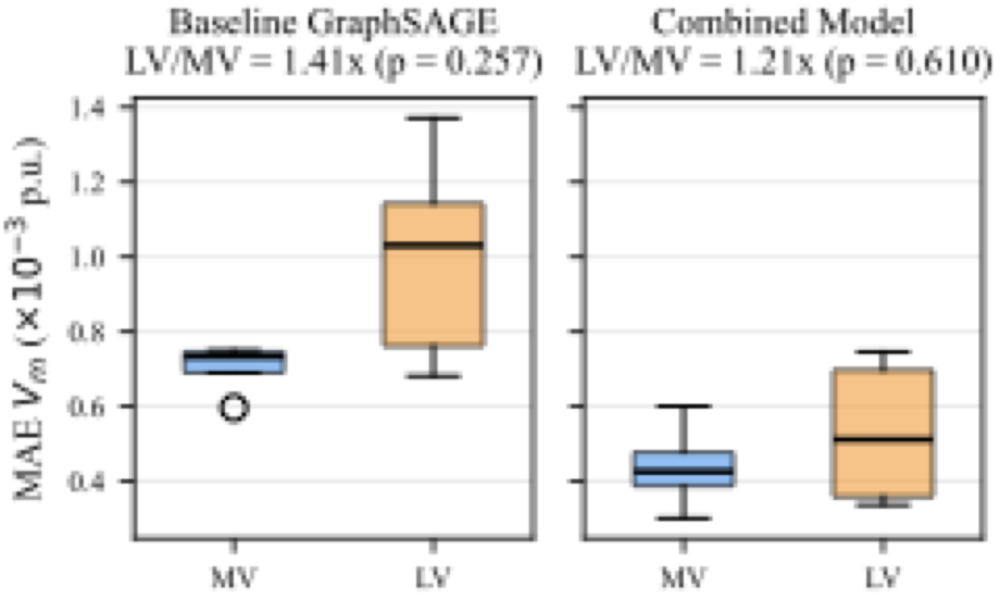
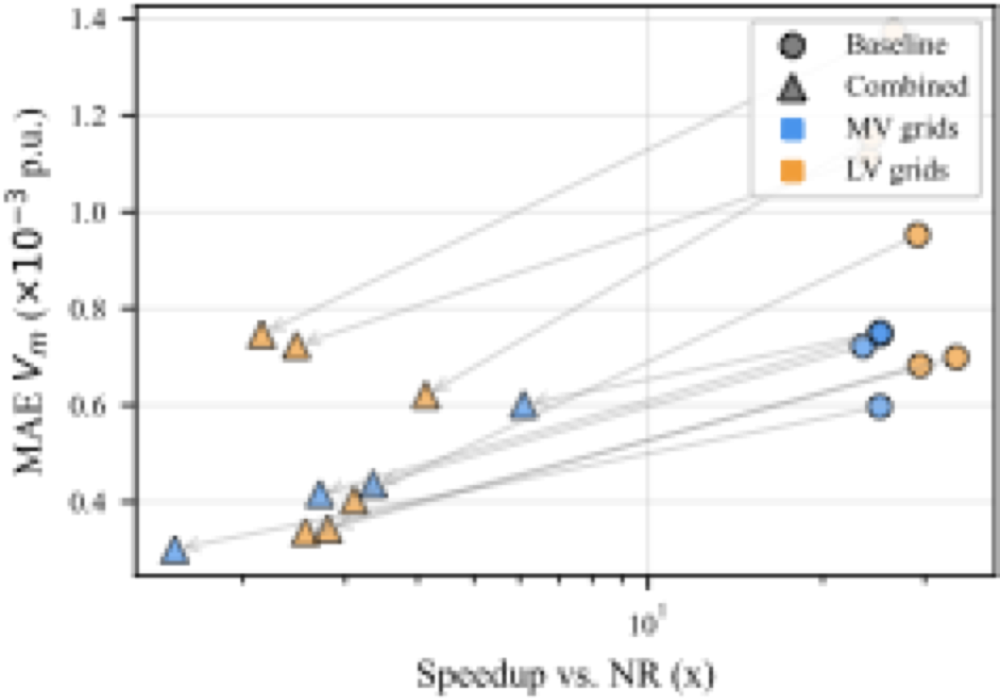
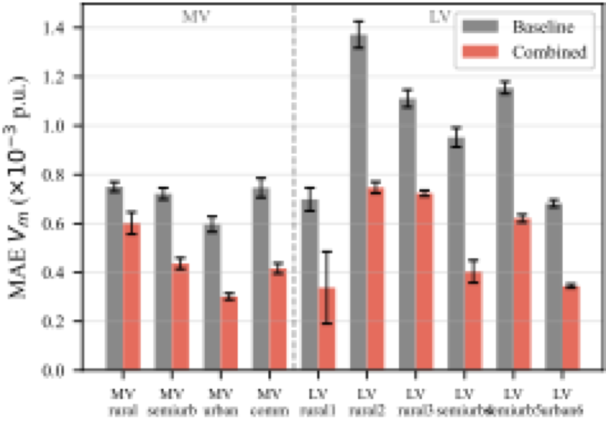

# Bridging the MV/LV Gap: Virtual Slack Nodes and Positional Encodings for GNN-Based Power Flow

Code and data for the paper **"Bridging the MV/LV Gap: Virtual Slack Nodes and Positional Encodings for GNN-Based Power Flow on Radial Distribution Networks"** by D. Voitekh and A. Tymoshenko.

## TL;DR

A GNN surrogate for AC power flow on radial distribution grids. Three techniques — **virtual slack edges**, **random-walk positional encodings**, and **residual GraphSAGE (d=8)** — combined close the MV/LV accuracy gap on SimBench.

| Model | MAE $V_m$ ($\times 10^{-3}$ p.u.) | LV/MV ratio | Speedup vs NR |
|-------|-----------------------------------|-------------|---------------|
| Baseline GraphSAGE (d=4) | 0.88 ± 0.25 | 1.41× (p=0.010) | 25× |
| **Combined** | **0.49** (**−44%**, p=0.002) | **1.21× (p=0.182)** | 2–6× |

## The idea in one picture

LV distribution feeders have long diameters (up to 56 hops in SimBench), but a standard 4-layer GNN can only aggregate information from nodes within 4 hops — so the slack reference voltage never reaches the far end. Virtual slack edges add a direct 2-hop shortcut from every bus to the slack.



Formally: for any connected graph $\mathcal{G}$ with slack vertex $s$, the augmented graph $\mathcal{G}'$ with bidirectional slack edges satisfies $\mathrm{diam}(\mathcal{G}') \leq 2$ (Proposition 1 in the paper).

## Evidence: baseline error tracks graph diameter

Spearman $\rho = +0.95$ ($p < 10^{-4}$) between grid diameter and baseline MAE. The combined model flattens this relationship — the method specifically targets high-diameter grids.



## Results at a glance

### MV/LV gap before and after


### Speed–accuracy Pareto frontier


### Per-grid comparison


## Requirements

- Python 3.12
- PyTorch 2.2
- PyTorch Geometric 2.5
- pandapower 2.14
- simbench, scipy, numpy, matplotlib

## Reproducing the results

```bash
# 1. Generate data for all grids (≈30 min on M1 Pro CPU)
python data_generation.py --all

# 2. Run all experiments (baseline, E1 physics, E2 PE, E3 depth, E4 virtual, E5 combined)
python run_all_experiments.py --experiment all --seeds 42 123 456

# 3. Analyze and generate figures
python analyze_results.py
python compute_correlations.py
python analyze_physics_loss.py
python generate_paper_figures.py
```

## Repository layout

- `configs.py` — grids, hyperparameters, seeds, paths
- `data_generation.py` — SimBench → pandapower NR → PyG Data objects
- `models.py` — GCN, GAT, GraphSAGE, ResidualGraphSAGE, MPNN, MLP
- `train.py` — AdamW + OneCycleLR + early stopping
- `evaluate.py` — MAE/RMSE/MaxAE + GNN vs NR timing
- `run_all_experiments.py` — full experiment runner (baseline/E1/E2/E3/E4/E5)
- `analyze_results.py` — main statistical analysis and tables
- `compute_correlations.py` — Spearman/Pearson correlations between grid structure and MAE
- `analyze_physics_loss.py` — quantitative evidence for physics-loss ineffectiveness
- `generate_paper_figures.py` — paper PDF figures
- `generate_readme_figures.py` — README PNG figures
- `results/` — raw JSON metrics for all 342 experiments (10 grids × ~11 configs × 3 seeds)

## Critical SimBench/pandapower fixes

Required for NR convergence on the full set of grids:

1. Transformer shift degrees set to zero (Yzn5 divergence fix)
2. `pandapower.create_continuous_bus_index(net)` (singular Jacobian fix)
3. NaN voltage-dependent load parameters replaced with zero
4. All switches removed: `net.switch.drop(net.switch.index)`

## License

MIT — see `LICENSE`.

## Citation

Citation entry will be added once the paper is accepted.
