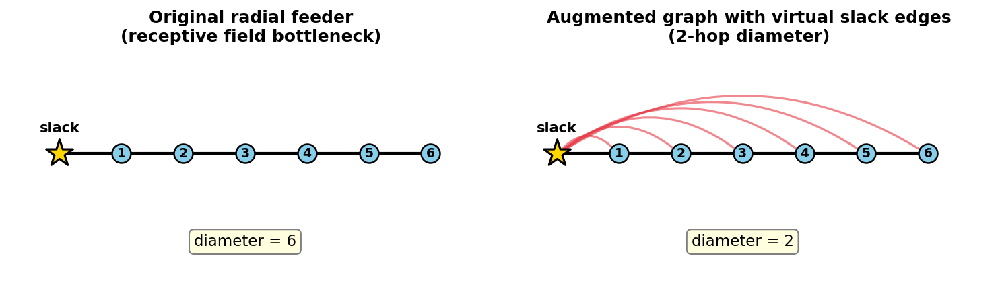
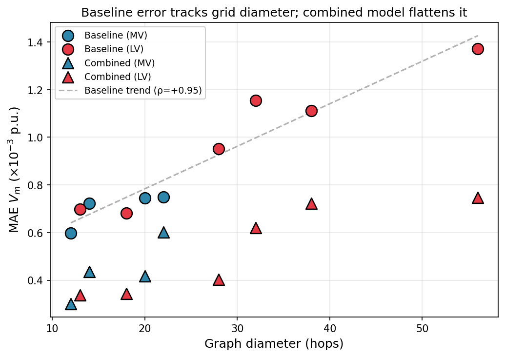
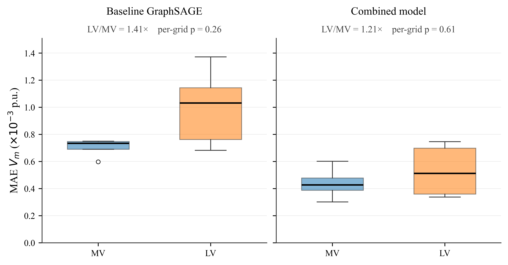
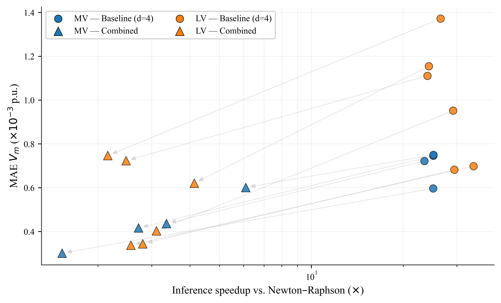
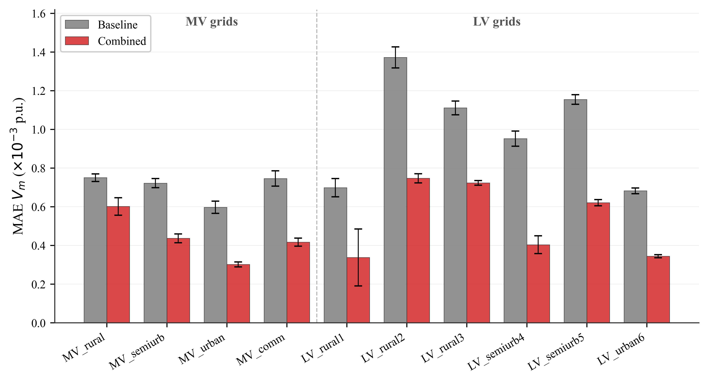

# Slack-Bus Shortcut Edges Close the MV/LV Gap in GNN-Based Power Flow on Radial Distribution Networks

Code, data, and trained models for the paper **"Slack-Bus Shortcut Edges Close the MV/LV Gap in GNN-Based Power Flow on Radial Distribution Networks"** by D. Voitekh and A. Tymoshenko.

## TL;DR

A GNN surrogate for AC power flow on radial distribution grids. Three interventions — **slack-bus shortcut edges**, **random-walk positional encodings**, and **residual GraphSAGE (d=8)** — combined reduce voltage-magnitude error by 44% on SimBench and bring the LV/MV gap below the per-grid Mann–Whitney detection threshold.

| Model | MAE $V_m$ ($\times 10^{-3}$ p.u.) | LV/MV ratio | Per-grid p (n=10) | Speedup vs NR |
|---|---|---|---|---|
| Baseline GraphSAGE (d=4) | 0.88 ± 0.25 | 1.41× | 0.26 (under-powered) | 25× |
| **Combined (this work)** | **0.49 ± 0.16** (**−44%**, Wilcoxon p=0.002) | **1.20×** | 0.61 | 2–6× |

## The idea in one picture

LV distribution feeders have long diameters (up to 56 hops in SimBench), but a standard 4-layer GNN can aggregate information only from nodes within 4 hops — so the slack reference voltage never reaches the far end. Slack-bus shortcut edges add a direct 2-hop message-passing path from every bus to the slack.



Formally: for any connected graph $\mathcal{G}$ with slack vertex $s$, the augmented graph $\mathcal{G}'$ with bidirectional shortcut edges from $s$ to every other node satisfies $\mathrm{diam}(\mathcal{G}') \leq 2$ (Proposition 1 in the paper).

Note: shortcut edges are **message-passing edges only**. They never enter the Newton–Raphson solver and are not interpreted as physical zero-impedance branches.

## Evidence: baseline error tracks graph diameter

Spearman $\rho = +0.95$ ($p < 10^{-4}$) between grid diameter and baseline MAE. The combined model flattens this relationship — the method specifically targets high-diameter grids.



## Results at a glance

### MV/LV gap before and after (per-grid means, n=4 MV vs n=6 LV)


### Speed–accuracy Pareto frontier


### Per-grid comparison


## Ablations

The paper reports two ablations beyond the standard E1–E5 sweep:

- **Hub-choice ablation (Table 3 in paper).** Slack-bus hub vs random non-slack hub vs generic virtual-node, on MV_rural and LV_rural2. On the hard LV grid, the slack-bus hub clearly wins (0.96 vs 1.16 vs 1.08 ×10⁻³ p.u.), confirming that the slack bus's physical role as the voltage reference matters.
- **Depth + PE without virtual edges (M3 ablation, Table 2 last row).** Residual GraphSAGE d=8 + RW-PE without shortcut edges gives only a 18% MAE reduction (vs 44% for the full combined model) and the LV/MV ratio remains at 1.34× (vs the baseline's 1.41×) — confirming that shortcut edges are the dominant driver.

## Tail-risk analysis

`compute_tail_risk.py` computes p95 / max absolute V_m error and near-limit (V_m outside [0.98, 1.02] p.u.) detection precision/recall. The combined model improves p95 and max on the worst grid (LV_rural2) but trades off near-limit recall on easier grids — see Table 7 in the paper.

## Negative result: voltage-smoothness regularisation

A slack-form regularisation $\mathcal{L}_{\text{smooth}} + \mathcal{L}_{\text{bounds}}$ tested with $\lambda \in \{10, 100, 1000\}$ produced no measurable improvement. A scale-mismatch analysis (paper Section 6) explains the redundancy on Z-score normalised NR targets. **This is not a verdict on strict Kirchhoff-residual PINN losses, which we did not test.**

## Requirements

- Python 3.12
- PyTorch 2.2
- PyTorch Geometric 2.5
- pandapower 2.14
- simbench, scipy, numpy, matplotlib, python-docx

## Reproducing the results

```bash
# 1. Generate data for all grids (~30 min on M1 Pro CPU)
python data_generation.py --all

# 2. Run the full sweep (baseline / E1 physics / E2 PE / E3 depth / E4 virtual / E5 combined)
python run_all_experiments.py --experiment all --seeds 42 123 456

# 3. Run the two extra ablations
python run_m3_ablation.py            # depth+PE without shortcut edges
python run_r10_ablation.py           # slack vs random vs generic-virtual hub
python compute_tail_risk.py          # p95, max, near-limit detection

# 4. Analyse and generate figures
python analyze_results.py
python compute_correlations.py
python analyze_physics_loss.py
python generate_paper_figures.py
```

## Repository layout

- `configs.py` — grids, hyperparameters, seeds, paths
- `data_generation.py` — SimBench → pandapower NR → PyG `Data` (incl. RW-PE and shortcut-edge augmentations; supports slack / random / new-node hub modes for R10)
- `models.py` — GCN, GAT, GraphSAGE, ResidualGraphSAGE, JKGraphSAGE, DropEdgeGraphSAGE, MPNN, MLP
- `train.py` — AdamW + OneCycleLR + early stopping
- `evaluate.py` — MAE / RMSE / MaxAE + GNN vs NR timing
- `run_all_experiments.py` — full E1–E5 runner
- `run_m3_ablation.py` — M3 ablation runner (depth + PE, no shortcut edges)
- `run_r10_ablation.py` — R10 hub-choice ablation runner
- `compute_tail_risk.py` — tail-risk + near-limit detection metrics
- `analyze_results.py` — main statistical analysis and tables
- `compute_correlations.py` — Spearman / Pearson correlations between grid structure and MAE
- `analyze_physics_loss.py` — quantitative evidence for smoothness-loss ineffectiveness
- `generate_paper_figures.py` — paper PDF figures (also exports 300 dpi PNGs to `assets/`)
- `generate_readme_figures.py` — README PNG figures
- `summarize_m3.py` — compact summary of M3 ablation results
- `paper/paper.tex` — LaTeX source (review-mode preprint)
- `paper/generate_eie_docx.py` — EE&E-format submission DOCX generator
- `results/` — raw JSON metrics for ~390 experiments (E1–E5 + M3 + R10 + tail-risk)

## Critical SimBench / pandapower fixes

Required for NR convergence on the full set of grids:

1. Transformer shift degrees set to zero (Yzn5 divergence fix)
2. `pandapower.create_continuous_bus_index(net)` (singular Jacobian fix)
3. NaN voltage-dependent load parameters replaced with zero
4. All switches removed: `net.switch.drop(net.switch.index)`

## License

MIT — see `LICENSE`.

## Citation

Citation entry will be added once the paper is accepted.
